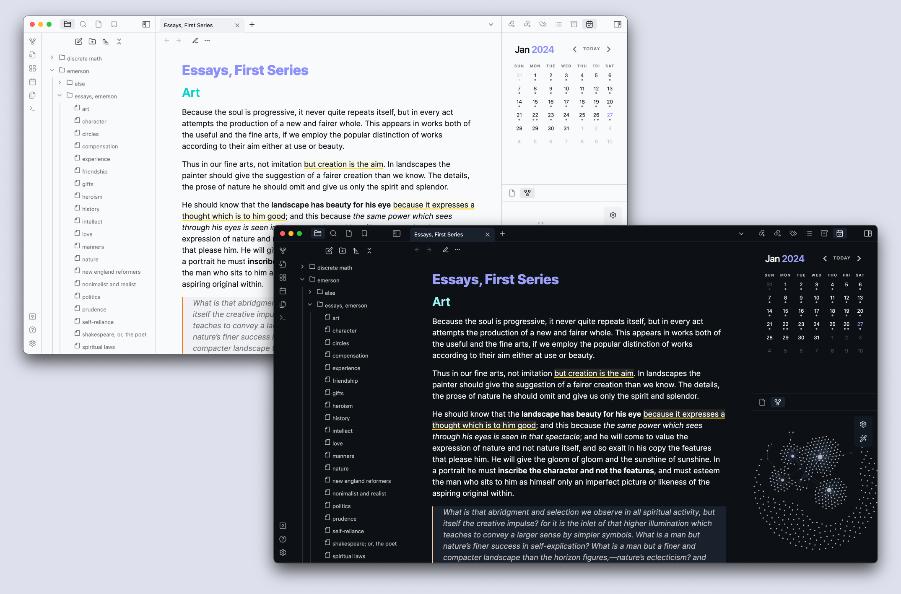
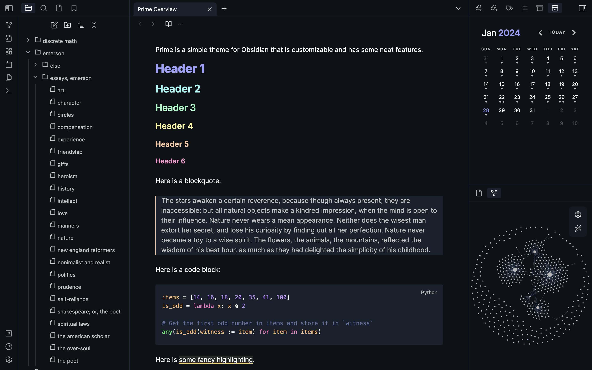
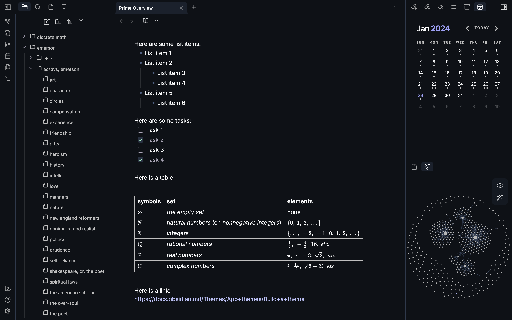
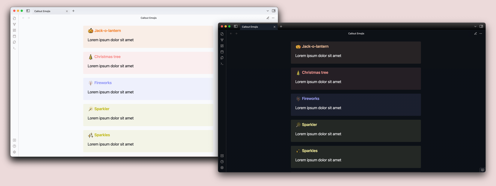
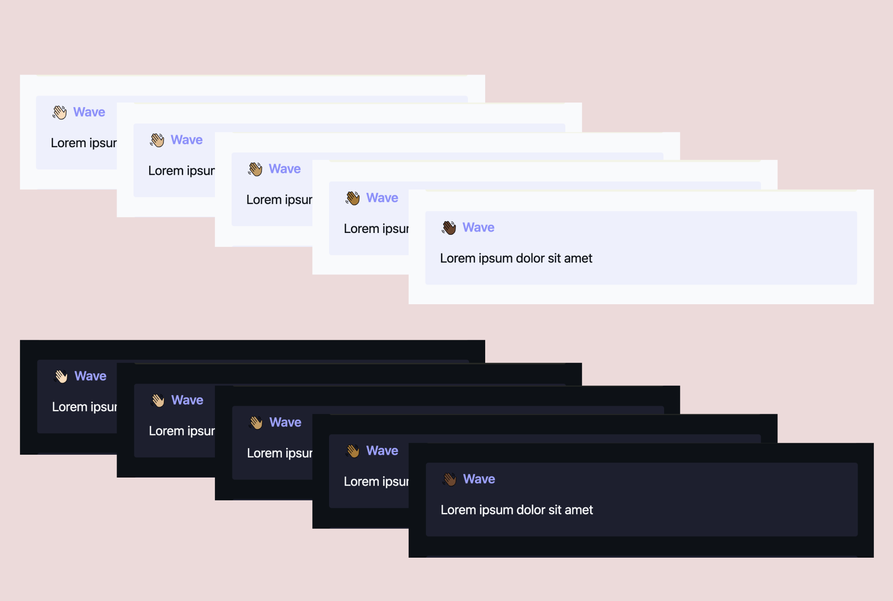

Prime is a simple theme for Obsidian that is customizable and has some neat features.



The motivation behind creating this theme is that I wanted a simple theme that only adds some color tweaks instead of introducing huge changes that modify the positioning of elements, font styles, etc. It started as an experiment, and I added some features that I'd like to use, such as syntax highlighting themes for code blocks, emojis as callout icons, and gradient frames (inspired by [Anuppuccin's Colorful Frames](https://github.com/AnubisNekhet/anuppuccin#colorful-frames) — which is adapted from the [Minimal theme](https://github.com/kepano/obsidian-minimal).)

This theme uses [Style Settings](https://github.com/mgmeyers/obsidian-style-settings) for easier customization.

You can buy me a coffee to support my work:

<a href="https://www.buymeacoffee.com/rivea0"></a>


## Installation

### Obsidian Themes

1. In Obsidian, go to **Settings**
2. Open the **Appearance** tab
3. Click **Manage** in **Themes**
4. Search for "Prime"
5. Click `Install and use` 🎉

### Manual

1. Clone this repository:

```
git clone git@github.com:rivea0/obsidian-prime.git
```

2. Create a folder named `Prime` inside the `.obsidian/themes` directory in your vault:

```
mkdir -p <path/to/your/vault>/.obsidian/themes/Prime
```

3. Copy `theme.css` and `manifest.json` to the `Prime` directory:

```
cp theme.css manifest.json <path/to/your/vault>/.obsidian/themes/Prime
```

4. Choose Prime from the **Themes** section under **Appearance** in Obsidian Settings 🎉

## Screenshots





## Features

### Syntax Highlighting Themes

Sometimes you want to use different themes for code blocks depending on your mood. (Right? 😐)

There are several theme options with dark and light variations. The default for the dark theme is [Dracula](https://github.com/dracula/dracula-theme), and for the light theme, an adaptation of [Material Theme Lighter](https://www.material-theme.dev).

#### Dark Theme Options

<details open>
    <summary>Dracula (Default)</summary>
    
</details>

<details>
    <summary>One Dark</summary>
    
</details>

<details>
    <summary>Catppuccin Frappé</summary>
    
</details>

<details>
    <summary>Catppuccin Macchiato</summary>
    
</details>

<details>
    <summary>Catppuccin Mocha</summary>
    
</details>

<details>
    <summary>Halcyon</summary>
    
</details>

<details>
    <summary>GitHub Dark</summary>
    
</details>

<details>
    <summary>Tokyo Night</summary>
    
</details>

#### Light Theme Options

<details open>
    <summary>Material Lighter (Default)</summary>
    
</details>

<details>
    <summary>One Dark (Light Variation)</summary>
    
</details>

<details>
    <summary>Catppuccin Frappé</summary>
    
</details>

<details>
    <summary>Catppuccin Latte</summary>
    
</details>

<details>
    <summary>GitHub Light</summary>
    
</details>

<details>
    <summary>Tokyo Night Light</summary>
    
</details>


### Snippets

#### Callout Emojis (with skin tones!)



You can add emojis as icons for your callouts just like usual type identifiers. For example, adding `[!cake]` inside a blockquote like this:

```markdown
> [!cake] Delicious custom title
> Here is a callout block
```

Will display:


You can also choose skin tones for the emojis that support them.



##### Usage:

You can easily navigate to the link using Style Settings:

1. In Obsidian Settings, go to **Style Settings** under **Community Plugins**
2. Select **Prime**
3. Click the link under the heading **Callouts with Emoji Support ✨**
4. Download the `callout-emojis.css` file that is opened
5. Add it to the `snippets` directory in `.obsidian` inside your vault
6. Go to **Appearance** tab, and enable `callout-emojis` under **CSS Snippets**

Or:

1. Download https://github.com/rivea0/obsidian-prime-snippets/blob/main/callout-emojis.css
2. Add it to the `snippets` directory in `.obsidian` inside your vault.
3. Go to **Appearance** tab, and enable `callout-emojis` under **CSS Snippets**


_Note: You can use the [Style Settings](https://github.com/mgmeyers/obsidian-style-settings) plugin to easily switch between skin tones._

Emojis are chosen from [OpenMoji](https://openmoji.org).

**See the list of all the emojis, examples, and how to extend them here: https://github.com/rivea0/obsidian-prime-snippets#callout-emojis**

#### Gradient Frames


You can add some color to your vault with gradient frames. This feature is pretty much inspired by [Anuppuccin's Colorful Frames](https://github.com/AnubisNekhet/anuppuccin#colorful-frames) — which is adapted from the [Minimal theme](https://github.com/kepano/obsidian-minimal). 

You can also easily choose the linear gradient direction (`top` or `bottom`) using [Style Settings](https://github.com/mgmeyers/obsidian-style-settings).

##### Usage:

You can easily navigate to the link using Style Settings:

1. In Obsidian Settings, go to **Style Settings** under **Community Plugins**
2. Select **Prime**
3. Click the link under the heading **Gradient Frames ✨**
4. Download the `gradient-frames.css` file that is opened
5. Add it to the `snippets` directory in `.obsidian` inside your vault.
6. Go to **Appearance** tab, and enable `gradient-frames` under **CSS Snippets**

Or:

1. Download https://github.com/rivea0/obsidian-prime-snippets/blob/main/gradient-frames.css
2. Add it to the `snippets` directory in `.obsidian` inside your vault
3. Go to **Appearance** tab, and enable `gradient-frames` under **CSS Snippets**

There are 42 gradients chosen from [WebGradients](https://webgradients.com).

**See the list of all the gradients, examples, and how to extend them here: https://github.com/rivea0/obsidian-prime-snippets#gradient-frames**

### Credits

- Thanks [Anuppuccin](https://github.com/AnubisNekhet/anuppuccin) by [@AnubisNekhet](https://github.com/AnubisNekhet) for the amazing use of Style Settings — which I learned from — and of course, for the gradient frames inspiration.
Both of these were eventually adapted from the [Minimal](https://github.com/kepano/obsidian-minimal) theme by [@kepano](https://github.com/kepano).

_You can [buy @AnubisNekhet a coffee](https://www.buymeacoffee.com/anubisnekhet)._

_You can [buy @kepano a coffee](https://www.buymeacoffee.com/kepano)._

- Fancy highlighting is adapted from the [Things](https://github.com/colineckert/obsidian-things) theme. The syntax colors for the One Dark theme are also from Things.

_You can buy [@colineckert (creator of the Things theme) a coffee](https://www.buymeacoffee.com/colineckert)._

- Dracula theme syntax colors from [Dracula Gemini](https://github.com/clbn/dracula-gemini).

- Catppuccin themes syntax colors from [Catppuccin Obsidian](https://github.com/catppuccin/obsidian).

- Halcyon syntax colors adapted from [Halcyon Obsidian](https://github.com/dbarenholz/halcyon-obsidian).

- GitHub theme syntax colors from [GitHub theme](https://github.com/krios2146/obsidian-theme-github).

- Syntax coloring for Material Lighter adapted from https://material-theme.com/docs/configuration/color-schemes.

- Tokyo Night syntax colors from [Obsidian Tokyo Night](https://github.com/tcmmichaelb139/obsidian-tokyonight).

### License

GPLv3
